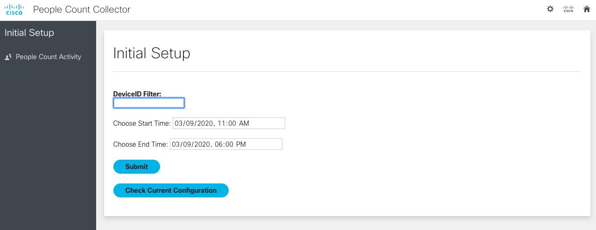

# Webex Room Device People Count Collector

This sample code retrieves peoplecount data from Cisco Webex Collaboration Room Devices periodically
and displays hourly averages on bar graphs that can be filtered by a specific time period and by
the name of the devices.


In this initial setup page, accessible from the cogwheel icon on the top right, you can set the initial time period to consider for
calculating hourly averages and any initial filtering you want to do on the Device IDs (i.e. RoomKit* will limit the list to only devices with IDs start with RoomKit)
You can always change the start and stop dates and select a specific device from a dropdown list when viewing the main page as you can see above.




## Configuration

Before running the application, the following steps must be followed:

1. If you will run this application on a Windows machine, download and install SQLLite (MacOS and most flavors of Linux already have it installed). Official download location: https://www.sqlite.org/download.html  . This tutorial gives more background on the process: https://www.sqlitetutorial.net/download-install-sqlite/
2. Make sure Python 3 is installed
3. Make sure pip is installed (https://pip.pypa.io/en/stable/installing/ for more information on pip)
4. Download or clone this repository to your computer
5. From the command line of a terminal window, change to the WebexRoomDevicesPeopleCountCollector directory where you cloned or downloaded the code
6. Enter 'pip install -r requirements.txt' into command line to download necessary libraries
7. Edit the **config.py** file and change the value for the READING_INTERVAL variable if desired. (default is READING_INTERVAL=300)
8. Copy the **devices_default.json** file to **devices.json** in the same directory
9. Edit the **devices.json** file to fill out the existing structures for each device you wish to report people count for:
- id (string containing a unique name for the endpoint)
- location (string with a description of the location of the device, just for reference)
- ipAddress (the ipAddress or hostname of the device)
- username (the username with rights to access the devices HTML API)
- password (the password for the username)

9. Copy the **db_default.sqlite3** file to **db.sqlite3** in the same directory. The code will not create this file on it's own, it needs a starter db.sqlite3 file with the proper table definitions to work


## Running the code

1. From the command line still in the WebexRoomDevicesPeopleCountCollector directory, enter ‘python3 flaskApp.py’. This starts the collection process and also makes the local web server available to see the web interface from a browser
2. Navigate your browser to the given url address (i.e. http://0.0.0.0:5003)
3. The application will query setup table in DB. If values throw an API call error when using app, user will be prompted to check configuration and input correct values.
4. If you would like to export all the readings collected by the app, follow the instructions to export the people_count_tbl table: https://www.sqlitetutorial.net/sqlite-tutorial/sqlite-export-csv/ .  
Here is a modified sample that matches the table we are using for this app and outputs to the file data.csv:
```
 
$ sqlite3 db.sqlite3
sqlite> .headers on
sqlite> .mode csv
sqlite> .output data.csv
sqlite> SELECT * from people_count_tbl;
sqlite> .quit
```
